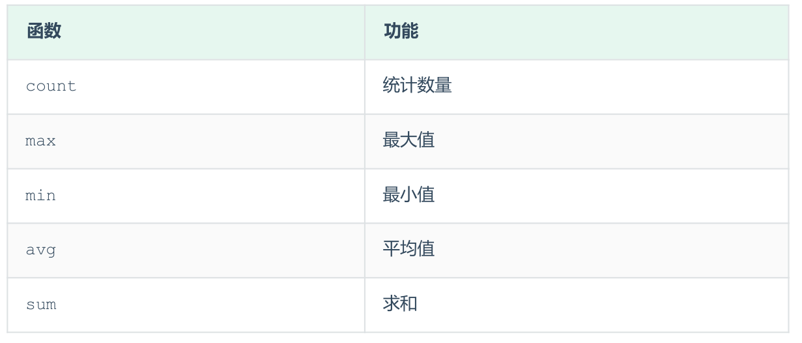

## 聚合函数
将一列数据作为一个整体，进行纵向计算 。
### 常见的聚合函数

### A. 统计该企业员工数量
```SQL
select count(*) from emp; -- 统计的是总记录数
select count(idcard) from emp; -- 统计的是idcard字段不为null的记录数
```
### B. 统计该企业员工的平均年龄
```SQL
select avg(age) from emp;
```
### C. 统计该企业员工的最大年龄
```SQL
select max(age) from emp;
```
### D. 统计该企业员工的最小年龄
```SQL
select min(age) from emp;
```
### E. 统计西安地区员工的年龄之和
```SQL
select sum(age) from emp where workaddress = '西安';
```