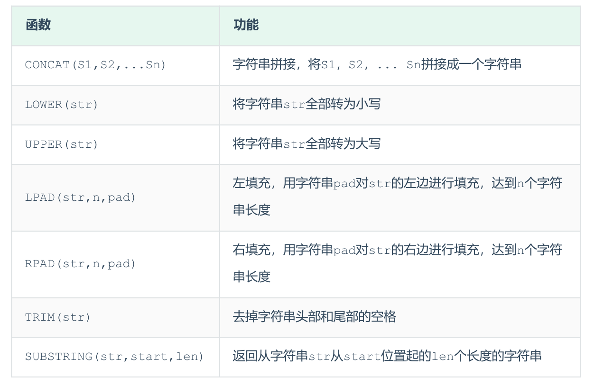

# 函数
函数是指一段可以直接被另一段程序调用的程序或代码。MySQL中的函数主要分为以下四类： 字符串函数、数值函数、日期函数、流程函数。
## 字符串函数

### A. concat : 字符串拼接
```SQL
select concat('Hello', 'World');
```
### B. lower : 全部转小写
```SQL
select lower('HELLO');
```
### C. upper : 全部转大写
```SQL
select upper('hello');
```
### D. lpad : 左填充
```SQL
select lpad('hi', 5, '_');
```
### E. rpad : 右填充
```SQL
select rpad('hi', 5, '#');
```
### F. trim : 去除空格 去掉字符串头部和尾部的空格
```SQL
select trim(" hello world ");
```
### G. substring : 截取子字符串
```SQL
select substring('Hello World', 1, 5);