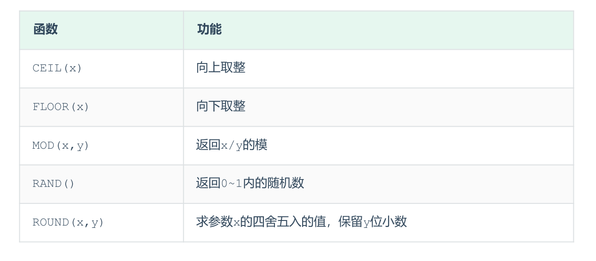

## 数值函数

### A. ceil：向上取整
```SQL
select ceil(1.1);
```
### B. floor：向下取整
```SQL
select floor(1.8);
```
### C. mod：取模
```SQL
select mod(7, 4);
```
### D. rand：获取随机数
```SQL
select rand();
```
### E. round：四舍五入
```SQL
select round(2.334, 2);
```
## 案例
通过数据库的函数，生成一个六位数的随机验证码。
```SQL
select lpad(round(rand(), 6)*1000000, 6, '0');
```

