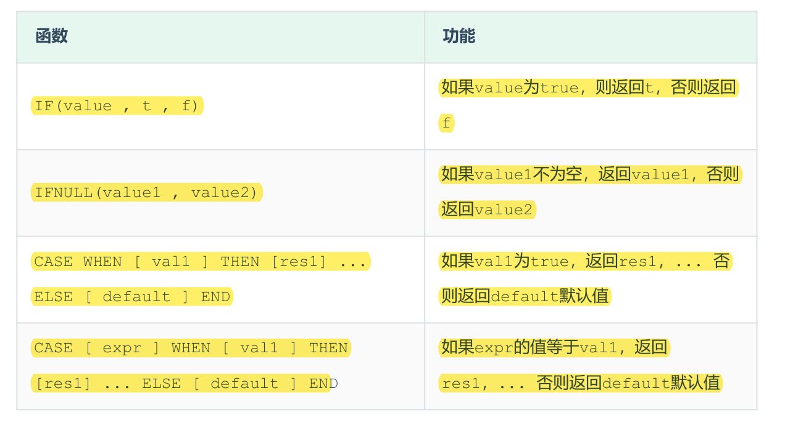

## 流程函数
流程函数也是很常用的一类函数，可以在SQL语句中实现条件筛选，从而提高语句的效率。

#### A. if
```SQL
select if(false, 'ok', 'no');
```
### B. ifnull
```SQL
select ifnull('', 'ok'); -- 依然返回''
select ifnull(null, 'ok');
select ifnull('ok', 'default');
```
### C. case when then else end
需求: 查询emp表的员工姓名和工作地址 (北京/上海 ----> 一线城市 , 其他 ----> 二线城市)
```SQL
select 
    name, 
    (case workaddress when '北京' then '一线城市' when '上海' then '一线城市' else '二线城市' end) as '工作地址' 
from emp;
```
## 案例
案例：统计班级各个学员的成绩，展示的规则如下  
\>= 85 展示为优秀  
\>= 60 展示为及格  
否则，展示为不及格  

插入数据
```SQL
create table score(
    id int comment 'ID',
    name varchar(20) comment '姓名',
    math int comment '数学',
    english int comment '英语',
    chinese int comment '语文'
) comment '学员成绩表';
insert into score(id, name, math, english, chinese) VALUES (1, 'Tom', 67, 88, 95), (2, 'Rose' , 23, 66, 90),(3, 'Jack', 56, 98, 76);
```
```SQL
select 
    id,
    name,
    (case math when math >= 85 then '优秀' when math >= 60 then '及格' else '不及格' end) as '数学成绩'，
    (case english when english >= 85 then '优秀' when english >= 60 then '及格' else '不及格' end) '英语成绩'，
    (case when chinese >= 85 then '优秀' when chinese >= 60 then '及格' else '不及格' end) as '中文成绩' 
from score;
