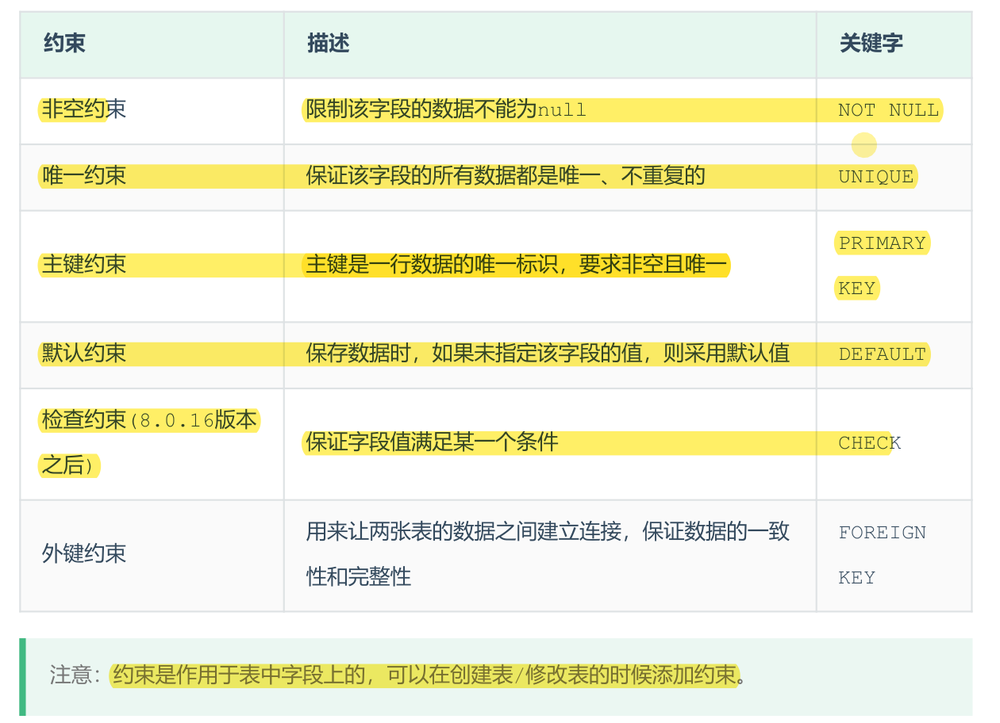

# 约束
概念：约束是作用于表中字段上的规则，用于限制存储在表中的数据。  
目的：保证数据库中数据的正确、有效性和完整性。



插入数据
```SQL
create table user (
    id int primary key auto_increment comment '主键',
    name char(10) not null unique comment '姓名',
    age int check ( age >= 0 and age <= 120 ) comment '年龄',
    status char(1) default '1' comment '状态',
    gender char(1) comment '性别'
) comment '用户表';
```
```SQL
-- 主键约束 主键是一行数据的唯一标识，要求非空且唯一 primary key
insert into user(name, age, status, gender) values ('Tom1', 19, '1', '男'),('Tom2', 25, '0', '男');
insert into user(name, age, status, gender) values ('Tom3', 19, '1', '男');
-- 非空约束 限制该字段的数据不能为null not null
insert into user(name, age, status, gender) values (null, 19, '1', '男');
-- 唯一约束 保证该字段的所有数据都是唯一、不重复的 unique
insert into user(name, age, status, gender) values ('Tom3', 19, '1', '男');
-- 检查约束 保证字段值满足某一个条件 check
insert into user(name, age, status, gender) values ('Tom4', 25, '1', '男');
insert into user(name, age, status, gender) values ('Tom5', -1, '1', '男');
insert into user(name, age, status, gender) values ('Tom5', 121, '1', '男');
-- 默认约束 保存数据时，如果未指定该字段的值，则采用默认值 default
insert into user(name, age, gender) values ('Tom5', 120, '男');
```
