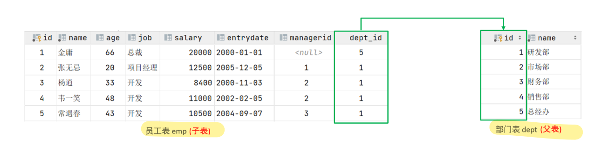
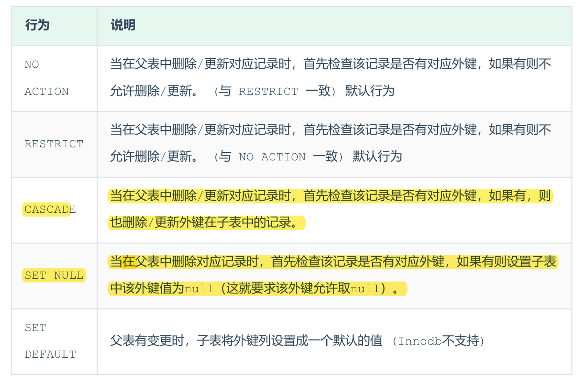

## 外键约束
外键：用来让两张表的数据之间建立连接，从而保证数据的一致性和完整性。  
我们来看一个例子：

左侧的emp表是员工表，里面存储员工的基本信息，包含员工的ID、姓名、年龄、职位、薪资、入职日期、上级主管ID、部门ID，在员工的信息中存储的是部门的ID dept_id，而这个部门的ID是关联的部门表dept的主键id，那emp表的dept_id就是外键,关联的是另一张表的主键。  
准备数据
```SQL
create table dept(
    id   int auto_increment comment 'ID' primary key,
    name varchar(50) not null comment '部门名称'
)comment '部门表';
INSERT INTO dept (id, name) VALUES (1, '研发部'), (2, '市场部'),(3, '财务部'), (4, '销售部'), (5, '总经办');

create table emp(
     id  int auto_increment comment 'ID' primary key,
     name varchar(50) not null comment '姓名',
     age  int comment '年龄',
     job varchar(20) comment '职位',
     salary int comment '薪资',
     entrydate date comment '入职时间',
     managerid int comment '直属领导ID',
     dept_id int comment '部门ID'
 )comment '员工表';

INSERT INTO emp (id, name, age, job,salary, entrydate, managerid, dept_id) VALUES
        (1, '金庸', 66, '总裁',20000, '2000-01-01', null,5),
        (2, '张无忌', 20, '项目经理',12500, '2005-12-05', 1,1),
        (3, '杨逍', 33, '开发', 8400,'2000-11-03', 2,1),
        (4, '韦一笑', 48, '开发',11000, '2002-02-05', 2,1),
        (5, '常遇春', 43, '开发',10500, '2004-09-07', 3,1),
        (6, '小昭', 19, '程序员鼓励师',6600, '2004-10-12', 2,1);
```
### 为emp表的dept_id字段添加外键约束,关联dept表的主键id。
```SQL
alter table emp add constraint fk_emp_dmp_id foreign key (dept_id) reference dept(id);
```
### 删除外键
```SQL
alter table emp drop foreign key fk_emp_dmp_id;
```
添加了外键约束之后，我们再到dept表(父表)删除id为1的记录，然后看一下会发生什么现象。 此时将会报错，不能删除或更新父表记录，因为存在外键约束。  
添加了外键之后，再删除父表数据时产生的约束行为，我们就称为删除/更新行为。具体的删除/更新行为有以下几种:

## cascade
```SQL
alter table emp add constraint fk_emp_dmp_id foreign key (dept_id) reference dept(id) on update cascade on delete cascade;
```
## set null
```SQL
alter table emp add constraint fk_emp_dmp_id foreign key (dept_id) reference dept(id) on update set null on delete set null;
```
 