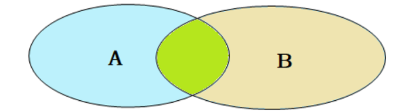

## 内连接
内连接查询的是两张表交集部分的数据。(也就是绿色部分的数据)内连接的语法分为两种: 隐式内连接、显式内连接。先来学习一下具体的语法结构。

### 案例
A. 查询每一个员工的姓名 , 及关联的部门的名称 (隐式内连接实现)  
表结构: `emp , dept`  
连接条件: `emp.dept_id = dept.id`  
```SQL
select e.name, d.name from emp e, dept d where e.dept_id = d.id;
```
B. 查询每一个员工的姓名 , 及关联的部门的名称 (显式内连接实现) --- INNER JOIN ... ON ...
表结构: `emp , dept`  
连接条件: `emp.dept_id = dept.id`  
```SQL
select e.name, d.name from emp e inner join dept d on e.dept_id = d.id;
```