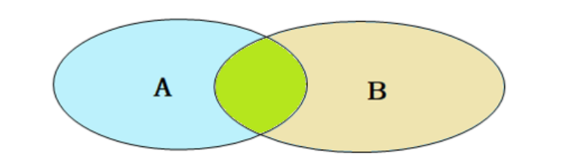

## 外连接

### 左外连接
左外连接相当于查询表1(左表)的所有数据，当然也包含表1和表2交集部分的数据。  
右外连接相当于查询表2(右表)的所有数据，当然也包含表1和表2交集部分的数据。  
### 案例
A. 查询emp表的所有数据, 和对应的部门信息  
由于需求中提到，要查询emp的所有数据，所以是不能内连接查询的，需要考虑使用外连接查询。  
表结构: `emp, dept`  
连接条件: `emp.dept_id = dept.id`  
```SQL
select e.*, d.name from emp e left join dept d on e.dept_id = d.id;
```
B. 查询dept表的所有数据, 和对应的员工信息(右外连接)  
由于需求中提到，要查询dept表的所有数据，所以是不能内连接查询的，需要考虑使用外连接查询。  
表结构: `emp, dept`  
连接条件: `emp.dept_id = dept.id`  
```SQL
select e.*, d.* from emp e right join dept d on e.dept_id = d.id;
```
### 注意事项：
左外连接和右外连接是可以相互替换的，只需要调整在连接查询时SQL中，表结构的先后顺序就可以了。而我们在日常开发使用时，更偏向于左外连接。