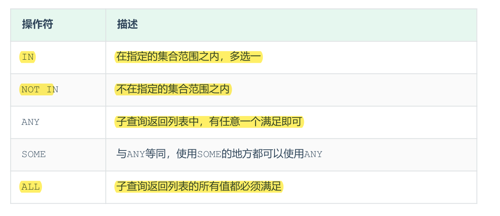

## 列子查询
子查询返回的结果是一列（可以是多行），这种子查询称为列子查询。  
常用的操作符：IN 、NOT IN 、 ANY 、SOME 、 ALL

### 案例
A. 查询 "销售部" 和 "市场部" 的所有员工信息
```SQL
-- 查询 "销售部" 和 "市场部" 的部门ID
select id from dept where name = '销售部' or '市场部';
```
```SQL
-- 根据部门ID, 查询员工信息
select * from emp where dept_id in (select id from dept where name = '销售部' or '市场部');
```
B. 查询比 财务部 所有人工资都高的员工信息
```SQL
-- 查询所有 财务部 人员工资
select id from dept where name = '财务部';

select salary from emp where dept_id = (select id from dept where name = '财务部');
```
```SQL
-- 比 财务部 所有人工资都高的员工信息
select * from emp where salary > all (select salary from emp where dept_id = (select id from dept where name = '财务部'));
```
C. 查询比研发部其中任意一人工资高的员工信息
```SQL
-- 查询研发部所有人工资
select id from dept where name = '研发部';
select salary from emp where dept_id = (select id from dept where name = '研发部');
```
```SQL
-- 比研发部其中任意一人工资高的员工信息
select * from emp where salary > any (select salary from emp where dept_id = (select id from dept where name = '研发部'));
```
