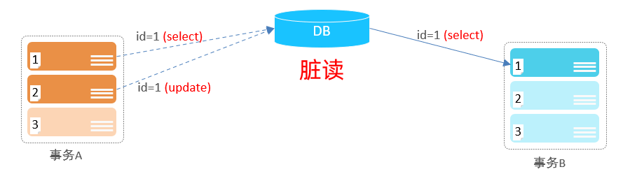
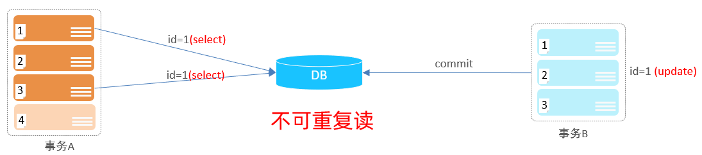
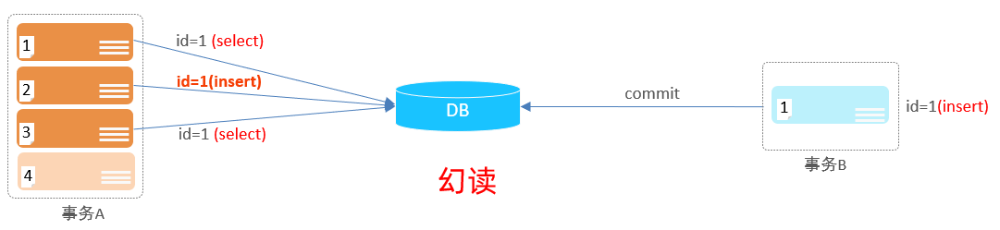

## 并发事务问题
### 赃读: 一个事务读到另外一个事务还没有提交的数据.

比如B读取到了A未提交的数据.

### 不可重复读: 一个事务先后读取同一条记录, 但两次读取的数据不同, 称之为不可重复读.

事务A两次读取同一条记录, 但是读取到的数据却是不一样的.

### 幻读: 一个事务按照条件查询数据时, 没有对应的数据行, 但是在插入数据时, 又发现这行数据已经存在, 好像出现了"幻影".

