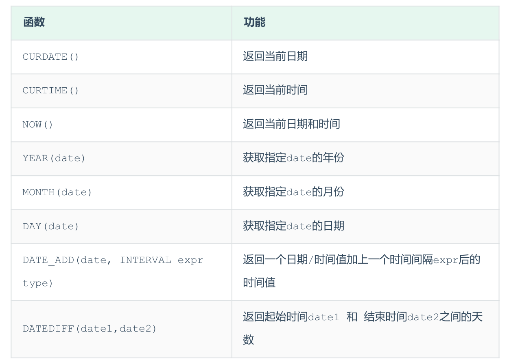

## 日期函数
常见的日期函数如下：

### A. curdate：当前日期
```SQL
select curdate();
```
### B. curtime：当前时间
```SQL
select curtime();
```
### C. now：当前日期和时间
```SQL
select now();
```
### D. YEAR , MONTH , DAY：当前年、月、日
```SQL
select year(now());
select month(now());
select day(now());
```
### E. date_add：增加指定的时间间隔
```SQL
select data_add(now(), interval 70 month);
```
### F. datediff：获取两个日期相差的天数
```SQL
select datediff('2046-07-01', now());
-- 第一个时间减去第二个时间
```
## 案例
查询所有员工的入职天数，并根据入职天数倒序排序。
```SQL
select name, datediff(curdate(), entrydate)  from emp order by entrydate desc;
```